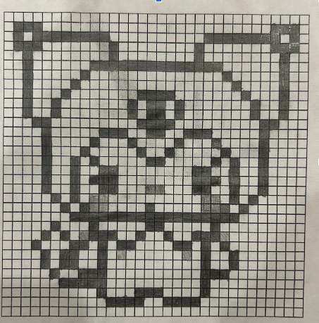
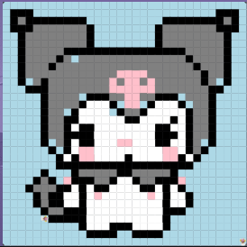

# Unit 1 - Asphalt Art

## Introduction

Cities use asphalt art to improve public safety, inspire their residents and visitors, and brighten communities. Your goal is to create asphalt art to revitalize The Neighborhood and bring the community together with the help of the Painter.

## Requirements

Use your knowledge of object-oriented programming, algorithms, the problem solving process, and decomposition strategies to create asphalt art:
- **Create a new subclass** – Create at least one new subclass of the PainterPlus class that is used for a component of the asphalt art design.
- **Plan an algorithm** – Use the problem solving process and decomposition strategies to plan an algorithm that incorporates a combination of sequencing, selection, and/or iteration.
- **Write a method** – Write at least one method in a PainterPlus subclass that contributes to a component of the asphalt art design.
- **Document your code** – Use comments to explain the purpose of the methods and code segments.

## Notes: Neighborhood & Painter Class

This project was created on Code.org's JavaLab platform using the built in Neightborhood GUI output. To test and edit this project you must build in Code.org's JavaLab with the Neighborhood GUI enabled. For reference to the Painter class documentation, [you can read more here.](https://studio.code.org/docs/ide/javalab/classes/Painter)

## Output:
sketch:

final:

## Reflection

1. Describe your project.

   - My project is of Kuromi, who is a Sanrio character. I chose to paint Kuromi because she is one of my favorite Sanrio characters and I have loved Sanrio/Kuromi since I was a kid.

2. What are two things about your project that you are proud of?

   - I am proud of the code that I have done because at first, I didn't even know how to get started, but once I got my methods down and after doing the top half of Kuromi, it became super easy. I am also proud of the painting itself. I know it is not the best, but I worked very hard on it and I tried my best. I personally think it looks pretty good, but objectively, there are things I could improve on.

3. Describe something you would improve or do differently if you had an opportunity to change something about your project.

   - Something I would change/do differently if I had the opportunity to change something about my project is the top half of Kuromi. I had to first outline the head, and then color it in, which was a struggle for me. It got a bit messed up and because of that, there are spots that aren't painted that should have been.